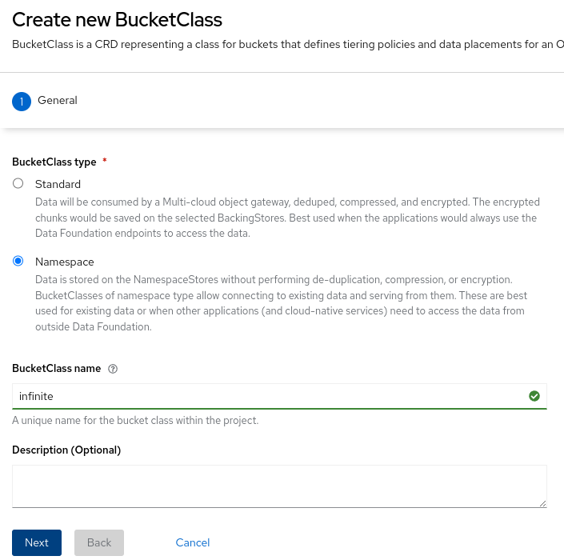

# Red Hat Ceph Storage Multi-Zone/Archive-Zone Lab

Red Hat Ceph Storage provides an RadosGateway (RGW/S3) which we want to configure in a way, you might now from AWS. 
So we will be setting up in the Lab a Region(Realm), Zones (East/West) and one of these Zones (Archive) is going to have a special setting which will not delete any objects created by the other Zones. Additionally we will have versions in the Archive-Zone and see a use-case of creating an infinite Bucket/File system with the possibility to restore a particular version in time into the East/West Zones


# Requirements
With the Product based on Red Hat, you mandatory need access to the Red Hat registry (base os image) as well as the Red Hat Ceph Storage RPM channels.

The Lab requires a bare minimum of 3 Virtual Machines with at least:
* 4 Cores
* 16 GB Memory
* 3x 50GB Disk space

DNS records excepted to be present:
* ceph1.example.com, Host system
    * east-rgw.example.com, RGW access same IP as Host system
* ceph2.example.com
    * west-rgw.example.com, RGW access same IP as Host system
* ceph3.example.com
    * archive-rgw.example.com, RGW access same IP as Host system

DNS names can be changed just ensure to update any occurance in the scripts accordingly. 

The Red Hat Ceph deployment will be a Single Node deployment with only 100GB of space for Bucket objects in RGW. The third 50GB is used for the OS disk. 

The use-case for creating an infinite Bucket/File system requires us to have an Red Hat OpenShift (OCP) Cluster with Red Hat OpenShift Data Foundation (ODF) installed with the MultiCloud Gateway (MCG). 

This requirement makes the Lab quite resource intensive and you can skip the OCP resource but will miss the expected outputs when we create the infinite Bucket. Still you will be able to see and understand the feature, just in a slightly different way.

My Lab is even based on running the Ceph VirtualMachines inside an OCP Cluster using Red Hat OpenShift Virtualization (OCP-V) but as long as you can run three machines that can reach each other through Network you should be fine to go.

Further notice that the Lab and scenario is not officially supported by Red Hat in any way.

### creating our Virtual Systems 
Login to Red Hat Customer Portal and navigate to the Download section for [Red Hat Enterprise Linux](https://access.redhat.com/downloads/content/479/ver=/rhel---9/9.3/x86_64/product-software) (we will base it on RHEL 9.3)
Select the `Red Hat Enterprise Linux 9.3 KVM Guest Image` for download.

Once available, we will now prepare the image to our needs 
* configure the subscription-manager to enable and download rhceph-tools-for-rhel-9
* install the necessary package (cephadm, podman)
* add an unprivileged user for the ceph deployment (cephadmin)
* create a registry authorization file
* create an ssh key for the cephadmin user

#### first we create a cmd file for the cephadmin customization
```
cat <<EOF> cmd.txt
subscription-manager register --username=... --password='...' --name=... --auto-attach --servicelevel='Self-Support'
subscription-manager repos --enable rhceph-6-tools-for-rhel-9-x86_64-rpms
dnf install cephadm podman -y 
useradd -G wheel cephadmin
sed -i -e " s#^%wheel.*#%wheel     ALL=(ALL)       NOPASSWD: ALL#; " /etc/sudoers
mkdir /root/.config/containers -p 
runuser	-u cephadmin -- ssh-keygen -N '' -f /home/cephadmin/.ssh/id_rsa
EOF
```
#### than we create a customized qcow2 image 
Before we can create the image we need to provide some more files for it.
1) auth.json, the Registry credentials allowing to fetch the Images
2) boostrap.sh from the LAB repository 
3) zone-bootstrap-*.sh from the Lab repository 

Your Registry credentials should be available at [console.redhat.com](https://console.redhat.com/openshift/install/pull-secret) 

Now customizing the image, that might take a while
```
virt-customize -a rhel-9.3-x86_64-kvm.qcow2 \
	--run cmd.txt \
	--copy-in auth.json:/root/.config/containers/ \
	--copy-in bootstrap.sh:/root \
    --copy-in zone-boostrap-archive.sh:/root \
    --copy-in zone-boostrap-primary.sh:/root \
    --copy-in zone-boostrap-secondary.sh:/root \
	--copy-in rollout-tmpl.yml:/root
```
Before we can use the image now, we need to ensure to remove any system specifics which we do by calling the sysprep on it

```
virt-sysprep -a rhel-9.3-x86_64-kvm.qcow2 \
    --operations machine-id,bash-history,logfiles,tmp-files,net-hostname,net-hwaddr
```
Since the Lab is based upon OCP-V my path changes from yours and please do not hesitate to ping me if you cannot get a qcow2 image up and running on KVM.
Bear in mind, the Requirements per VirtualMachine are
* 4 Cores
* 16GB Memory
* 1 Rootdisk (rhel-9.3-x86_64-kvm.qcow2)
* 2x Datadisks 50GB (empty)
* 1 Network interface (ensure to have http connectivity between the VM's)

### accessing our Virtual Systems 
The Lab assumes that your systems are called:
* ceph1 
* ceph2
* ceph3 

and reflect the Zones in following mapping
* ceph1 - east
* ceph2 -west
* ceph3 -archive

Please feel free to change the mapping to your need and adjust the commands followed accordingly.

#### East Zone Service (ceph1)
First we login and prepare the East Zone running on ceph1 
We need to export some bash variables to have the correct names configured for the setup.

```
$ ssh cloud-user@ceph1
[..output omitted..]
[cloud-user@ceph1 ~]$ sudo -i
[root@ceph1 ~]# 
export RGWREGION=emea
export RGWZONE=east
```
That is the bare minimum you need to set to get it running. Furthermore, ensure that your `hostname` and `ip` address are configured in DNS and map to the hosts.
```
export CEPHIP=$(ip -br a | awk '/eth0/ { print $3 }' | cut -f1 -d'/')
export RGWHOST=$(hostname)
export RGWPORT=80
```

If you want to double check that everything works as expected you can call following command after exporting these variables.
**NOTE** not all variables will be expanded when doing the command manually.
```
cat rollout-tmpl.yml | envsubst
service_type: host
addr: 192.168.0.1
hostname: ceph1.example.com
...
service_type: rgw
service_id: default.east
placement:
  label: rgw
spec:
  rgw_frontend_port: 80
  rgw_realm: emea
  rgw_zone: east
...
  hosts:
    - ceph1.example.com
data_devices:
  paths:
    - /dev/vdc
    - /dev/vdd
```

Also ensure that your VM maps the two empty 50GB disks as /dev/vdc and /dev/vdd or adjust those accordingly in the `rollout-tmpl.yml` file.

After verification of the config parameters being expanded to the values you expect, we can call the `bootstrap.sh` script and install our Red Hat Ceph Cluster.
```
# [root@ceph1 ~]
sh bootstrap.sh 

Creating directory /etc/ceph for ceph.conf
Verifying ssh connectivity using standard pubkey authentication ...
Adding key to cephadmin@localhost authorized_keys...
Verifying podman|docker is present...
[..output omitted..]
Bootstrap complete.
```
Check the health state of your Ceph cluster before you continue.
**NOTE** it might take a while until all has settled.
```
cephadm shell -v /root:/tmp
[..output omitted..]

# [ceph: root@ceph1 /] 
ceph -s
  cluster:
    id:     ffa81a82-e625-11ee-9c05-40f520f146bf
    health: HEALTH_OK
 
  services:
    mon: 1 daemons, quorum ceph1 (age 3m)
    mgr: ceph1.yzurpg(active, since 115s)
    osd: 2 osds: 2 up (since 89s), 2 in (since 104s)
    rgw: 1 daemon active (1 hosts, 1 zones)
 
  data:
    pools:   5 pools, 129 pgs
    objects: 197 objects, 453 KiB
    usage:   55 MiB used, 100 GiB / 100 GiB avail
    pgs:     129 active+clean
 
  io:
    client:   3.0 KiB/s rd, 255 B/s wr, 4 op/s rd, 3 op/s wr
 
  progress:
```
All `pgs` should be `active+clean` to ensure data can be added.

#### West Zone Service (ceph2)
Repeat the process from East Zone but ensure to have at least following variables set:
```
# [root@ceph2 ~]
export RGWREGION=emea
export RGWZONE=west
```

#### Archive Zone Service (ceph3)
Repeat the process from East Zone but ensure to have at least following variables set:
```
# [root@ceph3 ~]
export RGWREGION=emea
export RGWZONE=archive
```

### setting up the Primary Zone in our Multi-Zone setup
Again the Lab assumes the Primary Zone is running on east(ceph1).

```
# if you did exit the cephadm shell command or missed the mount please execute following
# cephadm shell -v /root:tmp 
# cephadm shell [ceph: root@ceph1 /]
export RGWREGION=emea
export RGWZONE=east
export DOMAIN="example.com"
export RGWMASTER="east-rgw"
export RGWPORT=80
sh /tmp/zone-boostrap-primary.sh
```

Since we are running on bare minimum the script is going to remove 
* alertmanager
* grafana
* prometheus 
which are not necessary in our Lab
Afterwards the script will configure
* a realm (region) 
* a zonegroup (which takes care of synchronization)
* a zone (which identifies the RGW in the realm/zonegroup)
* remove the default zonegroup
* remove the default zone
* remove the pools that have been created for the default zone
* create a replication user 
* set the `rgw_zone` parameter to the zone name
* restart the RGW service

if everything works out you should see at the end following output in the `radosgw-admin command`.
```
# cephadm shell [ceph: root@ceph1 /]
radosgw-admin sync status

          realm f569d06d-9bad-4a86-88f9-3f42cb4b1153 (emea)
      zonegroup 48580e07-231a-4b52-b99c-a175f122de1e (emea)
           zone 54ebd076-3ad1-4d4f-800f-ba16978d189a (east)
   current time 2024-03-20T07:03:00Z
zonegroup features enabled: resharding
                   disabled: compress-encrypted
  metadata sync no sync (zone is master)
```
### setting up the Secondary Zone in our Multi-Zone setup

ensure that the Primary Zone setup section has finished successful 
Than execute following to configure the west zone
```
# cephadm shell [ceph: root@ceph2 /]
export DOMAIN="example.com"
export RGWREGION=emea
export RGWZONE=west
export RGWPORT=80
export RGWMASTER="east-rgw"
sh /tmp/zone-boostrap-secondary.sh 
```
check that the zonegroup has been successfully updated
```
# cephadm shell [ceph: root@ceph2 /]
radosgw-admin sync status

          realm f569d06d-9bad-4a86-88f9-3f42cb4b1153 (emea)
      zonegroup 48580e07-231a-4b52-b99c-a175f122de1e (emea)
           zone 118838ff-1bfc-4abd-a0f4-a78dcef5f31e (west)
   current time 2024-03-20T07:00:23Z
zonegroup features enabled: resharding
                   disabled: compress-encrypted
  metadata sync syncing
                full sync: 0/64 shards
                incremental sync: 64/64 shards
                metadata is caught up with master
      data sync source: 54ebd076-3ad1-4d4f-800f-ba16978d189a
                        syncing
                        full sync: 0/128 shards
                        incremental sync: 128/128 shards
                        data is caught up with source
```

### setting up the Archive Zone in our Multi-Zone setup

ensure that the Primary Zone setup section has finished successful 
Than execute following to configure the archive zone
```
# cephadm shell [ceph: root@ceph2 /]
export DOMAIN="example.com"
export RGWREGION=emea
export RGWZONE=archive
export RGWPORT=80
export RGWMASTER="east-rgw"
sh /tmp/zone-boostrap-archive.sh 
```
check that the zonegroup has been successfully updated
```
# cephadm shell [ceph: root@ceph3 /]
radosgw-admin sync status

          realm f569d06d-9bad-4a86-88f9-3f42cb4b1153 (emea)
      zonegroup 48580e07-231a-4b52-b99c-a175f122de1e (emea)
           zone fcb040c5-4841-4707-8bf3-f0306ff25344 (archive)
   current time 2024-03-20T07:00:36Z
zonegroup features enabled: resharding
                   disabled: compress-encrypted
  metadata sync syncing
                full sync: 0/64 shards
                incremental sync: 64/64 shards
                metadata is caught up with master
      data sync source: 118838ff-1bfc-4abd-a0f4-a78dcef5f31e
                        syncing
                        full sync: 0/128 shards
                        incremental sync: 128/128 shards
                        data is caught up with source
                source: 54ebd076-3ad1-4d4f-800f-ba16978d189a
                        syncing
                        full sync: 0/128 shards
                        incremental sync: 128/128 shards
                        data is caught up with source
```

### configuring some users and buckets

Before we start populating Users and Buckets, I want to get your attention on the concept. 
Multi-Zone means that Zone-A syncs to Zone-B and vice-versa. The Archive-Zone on the other hand syncs from Zone-A and Zone-B but both Zones do not get updates from the Archive-Zone. That means that you should not configure anything related to those two Zones and content (Buckets, Users, Settings,..) on the Archive-Zone.
Furthermore, Metadata (creating Buckets, Users) should only be done on the primary/master Zone. You could still configure Metadata on the west Zone but you will need to fix the metadata inconsistency afterwards.
```
# [ceph: root@ceph2 /]
radosgw-admin user create --uid=user11 \
     --display-name="West-Zone user11" \
     --access-key=user11user11 \
     --secret=user11user11user11 

Please run the command on primary zone. Performing this operation on non-primary zone leads to inconsistent metadata between zones
Are you sure you want to go ahead? (requires --yes-i-really-mean-it)     
```

To show case the concept we are going to configure 10 Users and Buckets on Zone east. We should end up with 10 Users on all Zones.
```
# use east Zone (ceph1)
# cephadm shell [ceph: root@ceph1 /]
for n in $(seq 1 10) ; do 
   radosgw-admin user create --uid=user${n} \
     --display-name="East-Zone user${n}" \
     --access-key=user${n}user${n} \
     --secret=user${n}user${n}user${n} 
done
```
```
# use west Zone (ceph2)
# cephadm shell [ceph: root@ceph2 /]
radosgw-admin user list
[
    "user9",
    "user6",
    "eastwestrepluser",
    "user2",
    "user8",
    "user3",
    "user1",
    "user10",
    "user7",
    "user4",
    "user5"
]
# use archive Zone (ceph3)
# cephadm shell [ceph: root@ceph3 /]
radosgw-admin user list
[
    "user9",
    "user6",
    "eastwestrepluser",
    "user2",
    "user8",
    "user3",
    "user1",
    "user10",
    "user7",
    "user4",
    "user5"
]
```
Now let's create the respective Buckets for each user too
```
# you need AWS cli installed 
# the client can be any host who is able to reach the RGW endpoints
for n in $(seq 1 10) ; do 
 AWS_ACCESS_KEY_ID=user${n}user${n} \
 AWS_SECRET_ACCESS_KEY=user${n}user${n}user${n} \
 aws s3api --endpoint=http://east-rgw.example.com \
   create-bucket \
   --bucket=user${n} \
   --region=east 
done 
```
### Multi-Zone and Archive-Zone replication tests
With our Users and Buckets being configured it's now time to put some data in the buckets and monitor replication between Zones.
#### East Zone data creation
to see what get's written and replicated where we are going to suffix the content we create with zone names. In real-life it doesn't matter but for the purpose of the Lab it is easier to track the replication in that way.

```
# upload some sample data to east/user1 bucket
AWS_ACCESS_KEY_ID=user1user1 \
AWS_SECRET_ACCESS_KEY=user1user1user1 \
  aws s3 --endpoint=http://east-rgw.example.com \
    cp /etc/redhat-release s3://user1/file1-east 

upload: ../../etc/redhat-release to s3://user1/file1-east        
```
now verifying that the content was replicated accordingly we check each region manually with changing the `--endpoint=` 
```
for region in east west archive ; do 
  echo ${region}
  AWS_ACCESS_KEY_ID=user1user1 \
  AWS_SECRET_ACCESS_KEY=user1user1user1 \
    aws s3 --endpoint=http://${region}-rgw.example.com \
    ls s3://user1/file1-east
done

2024-03-20 08:49:45         44 file1-east
2024-03-20 08:49:45         44 file1-east
2024-03-20 08:49:45         44 file1-east
```
That was easy or ? 
#### West Zone data creation
repeating the exercise to verify data being replicated when hitting West Zone instead of East Zone
```
AWS_ACCESS_KEY_ID=user1user1 \
AWS_SECRET_ACCESS_KEY=user1user1user1 \
  aws s3 --endpoint=http://west-rgw.example.com \
    cp /etc/redhat-release s3://user1/file1-west

upload: ../../etc/redhat-release to s3://user1/file1-west
```
now verifying that the content was replicated accordingly we check each region manually with changing the `--endpoint=` 
```
for region in east west archive ; do 
  echo ${region}
  AWS_ACCESS_KEY_ID=user1user1 \
  AWS_SECRET_ACCESS_KEY=user1user1user1 \
    aws s3 --endpoint=http://${region}-rgw.example.com \
    ls s3://user1/file1-west
done 

2024-03-20 08:55:54         44 file1-west
2024-03-20 08:55:54         44 file1-west
2024-03-20 08:55:54         44 file1-west
```
#### Archive Zone data no/creation 
As mentioned before, the Archive Zone is not meant to be used by everyone. It's a read-only access point for users and a safety net for Administrators.

Right now, we do not have any option in RGW itself to limit users to modify content so accessing the RGW instance of the Archive Zone is the only option available right now.

Still for the purpose of the Lab, we are going to violate the concept and break replication due to manually changing content and see how we can resolve the situation.

Assuming you have followed the east/west data creation section we should have some files in our Bucket of user1 in the Archive Zone.

```
AWS_ACCESS_KEY_ID=user1user1 \
AWS_SECRET_ACCESS_KEY=user1user1user1 \
  aws s3 ls --endpoint=http://archive-rgw.example.com \
  s3://user1/

2024-03-20 08:49:45         44 file1-east
2024-03-20 08:55:54         44 file1-west
```
We now delete the `file1-east` from the Bucket with 

```
AWS_ACCESS_KEY_ID=user1user1 \
AWS_SECRET_ACCESS_KEY=user1user1user1 \
  aws s3 rm --endpoint=http://archive-rgw.example.com \
  s3://user1/file1-east

delete: s3://user1/file1-east
```

Now when again listing our Bucket content in the Archive Zone we will still see `file1-east` being in the Bucket 

```
AWS_ACCESS_KEY_ID=user1user1 \
AWS_SECRET_ACCESS_KEY=user1user1user1 \
  aws s3api list-object-versions \
  --endpoint=http://archive-rgw.example.com \
  --bucket=user1 

{
    "Versions": [
        {
            "ETag": "\"55a6fe94cb4bbc0e1bd3302fbd5ce787\"",
            "Size": 44,
            "StorageClass": "STANDARD",
            "Key": "file1-east",
            "VersionId": "M3OsDlf9M8lCEbFUsUP8WOYUiGwJy9d",
            "IsLatest": false,
            "LastModified": "2024-03-20T07:49:45.244000+00:00",
            "Owner": {
                "DisplayName": "East-Zone user1",
                "ID": "user1"
            }
        },
        {
            "ETag": "\"55a6fe94cb4bbc0e1bd3302fbd5ce787\"",
            "Size": 44,
            "StorageClass": "STANDARD",
            "Key": "file1-west",
            "VersionId": "m6HeML64Ggdg8r0oU0dZPdQTY1XeK55",
            "IsLatest": true,
            "LastModified": "2024-03-20T07:55:54.753000+00:00",
            "Owner": {
                "DisplayName": "East-Zone user1",
                "ID": "user1"
            }
        }
    ],
    "DeleteMarkers": [
        {
            "Owner": {
                "DisplayName": "East-Zone user1",
                "ID": "user1"
            },
            "Key": "file1-east",
            "VersionId": "WX9MiNvXsqoneuf63n..vjIjrwCHIo6",
            "IsLatest": true,
            "LastModified": "2024-03-20T10:28:03.125000+00:00"
        }
    ]
}
```
but listing will not show it as we have only uploaded one version so far (that's an expected change of behavior)
```
AWS_ACCESS_KEY_ID=user1user1 \
AWS_SECRET_ACCESS_KEY=user1user1user1 \
  aws s3 --endpoint=http://archive-rgw.example.com \
  ls s3://user1/

2024-03-20 08:55:54         44 file1-west
```
Furthermore since we do not sync from Archive-Zone to east/west-Zones they will still show the file and being able to retrieve it's content 

```
AWS_ACCESS_KEY_ID=user1user1 \
AWS_SECRET_ACCESS_KEY=user1user1user1 \
  aws s3 --endpoint=http://east-rgw.example.com \
  ls s3://user1/

2024-03-20 08:49:45         44 file1-east
2024-03-20 08:55:54         44 file1-west

AWS_ACCESS_KEY_ID=user1user1 \
AWS_SECRET_ACCESS_KEY=user1user1user1 \
  aws s3 --endpoint=http://west-rgw.example.com \
  ls s3://user1/

2024-03-20 08:49:45         44 file1-east
2024-03-20 08:55:54         44 file1-west
```
If we now upload a new file content for `file1-east` replication will not happen between east/west -> Archive Zone any more for the file.

```
AWS_ACCESS_KEY_ID=user1user1 \
AWS_SECRET_ACCESS_KEY=user1user1user1 \
  aws s3 --endpoint=http://east-rgw.example.com \
  cp /etc/issue s3://user1/file1-east

upload: ../../etc/issue to s3://user1/file1-east             
```
verifying new content replication on all Zones

```
for region in east west archive ; do
    echo ${region} 
    AWS_ACCESS_KEY_ID=user1user1 \
    AWS_SECRET_ACCESS_KEY=user1user1user1 \
      aws s3 --endpoint=http://${region}-rgw.example.com \
      ls s3://user1/
done

east
2024-03-20 11:34:53       1445 file1-east
2024-03-20 08:55:54         44 file1-west
west
2024-03-20 11:34:53       1445 file1-east
2024-03-20 08:55:54         44 file1-west
archive
2024-03-20 08:55:54         44 file1-west
```

As mentioned, Archive-Zone did not receive any new version of `file1-east` as with our manual modification we did move out of sync of the data epoch.

How to solve such a situation (and yes that's a Lab workaround as n^mill files in that way is just not a good idea)
We need to transport the file create to the Archive-Zone manually and create another version in east/west which caused replication to startup again for that particular file.
First, we'll check if new content will still be replicated by creating `file2-east`

```
AWS_ACCESS_KEY_ID=user1user1 \
AWS_SECRET_ACCESS_KEY=user1user1user1 \
  aws s3 --endpoint=http://east-rgw.example.com \
  cp /etc/issue s3://user1/file2-east

upload: ../../etc/issue to s3://user1/file2-east               
```
verification of the newly created file 
```
for region in east west archive ; do
    echo ${region} 
    AWS_ACCESS_KEY_ID=user1user1 \
    AWS_SECRET_ACCESS_KEY=user1user1user1 \
      aws s3 --endpoint=http://${region}-rgw.example.com \
      ls s3://user1/
done
  
east
2024-03-20 11:34:53       1445 file1-east
2024-03-20 08:55:54         44 file1-west
2024-03-20 11:41:20       1445 file2-east
west
2024-03-20 11:34:53       1445 file1-east
2024-03-20 08:55:54         44 file1-west
2024-03-20 11:41:20       1445 file2-east
archive
2024-03-20 08:55:54         44 file1-west
2024-03-20 11:41:20       1445 file2-east
```
Now copy over the conent from East Zone `file1-east` to the Archive Zone.

```
# in real-life you would first download the content and upload it afterwards
AWS_ACCESS_KEY_ID=user1user1 \
AWS_SECRET_ACCESS_KEY=user1user1user1 \
  aws s3 --endpoint=http://archive-rgw.example.com \
  cp /etc/issue s3://user1/file1-east

upload: ../../etc/issue to s3://user1/file1-east               
```
now we should have recreated sync manually 

```
for region in east west archive ; do
    echo ${region} 
    AWS_ACCESS_KEY_ID=user1user1 \
    AWS_SECRET_ACCESS_KEY=user1user1user1 \
      aws s3 --endpoint=http://${region}-rgw.example.com \
      ls s3://user1/
done

east
2024-03-20 11:34:53       1445 file1-east
2024-03-20 08:55:54         44 file1-west
2024-03-20 11:41:20       1445 file2-east
west
2024-03-20 11:34:53       1445 file1-east
2024-03-20 08:55:54         44 file1-west
2024-03-20 11:41:20       1445 file2-east
archive
2024-03-20 11:43:28       1445 file1-east
2024-03-20 08:55:54         44 file1-west
2024-03-20 11:41:20       1445 file2-east
```

Changing `file1-east` in Zone `east` in content should get replicated again without manual intervention 
```
AWS_ACCESS_KEY_ID=user1user1 \
AWS_SECRET_ACCESS_KEY=user1user1user1 \
  aws s3 --endpoint=http://east-rgw.example.com cp /etc/redhat-release s3://user1/file1-east

upload: ../../etc/redhat-release to s3://user1/file1-east       
```
verify that all Zones have the same content now

```
for region in east west archive ; do
    echo ${region} 
    AWS_ACCESS_KEY_ID=user1user1 \
    AWS_SECRET_ACCESS_KEY=user1user1user1 \
      aws s3 --endpoint=http://${region}-rgw.example.com \
      ls s3://user1/
done

east
2024-03-20 11:46:03         44 file1-east
2024-03-20 08:55:54         44 file1-west
2024-03-20 11:41:20       1445 file2-east
west
2024-03-20 11:46:03         44 file1-east
2024-03-20 08:55:54         44 file1-west
2024-03-20 11:41:20       1445 file2-east
archive
2024-03-20 11:46:03         44 file1-east
2024-03-20 08:55:54         44 file1-west
2024-03-20 11:41:20       1445 file2-east
```
We'll notice that our `versions` of the file in Archive-Zone have changed accordingly

```
AWS_ACCESS_KEY_ID=user1user1 \
AWS_SECRET_ACCESS_KEY=user1user1user1 \
  aws s3api list-object-versions \
  --endpoint=http://archive-rgw.example.com \
  --bucket=user1 \
  --prefix file1-east | \
  jq -r '.Versions[] | .ETag ' 

"55a6fe94cb4bbc0e1bd3302fbd5ce787"  # < replication restart version
"8a027ad2323a2b66924b3876492f361e"  # < second/manual version
"55a6fe94cb4bbc0e1bd3302fbd5ce787"  # < first version
```
WooWoo ! :D


### Infinite S3 Bucket/S3FS concept
For the infinite test, we need to create more content to have some show case.

```
for n in $(seq 1 100) ; do
  AWS_ACCESS_KEY_ID=user1user1 \
  AWS_SECRET_ACCESS_KEY=user1user1user1 \
    aws s3 --endpoint=http://east-rgw.example.com \
      cp /etc/redhat-release s3://user1/file${n}-east
done
[..output omitted..]
for n in $(seq 1 100) ; do
  AWS_ACCESS_KEY_ID=user1user1 \
  AWS_SECRET_ACCESS_KEY=user1user1user1 \
    aws s3 --endpoint=http://west-rgw.example.com \
      cp /etc/redhat-release s3://user1/file${n}-west
done
[..output omitted..]
```

After this has finished we should have three Zones with each of them having 200 files inside Bucket `user1`

```
for region in east west archive ; do
  echo ${region}
  AWS_ACCESS_KEY_ID=user1user1 \
  AWS_SECRET_ACCESS_KEY=user1user1user1 \
  aws s3 --endpoint=http://${region}-rgw.example.com \
    ls s3://user1/ | \
      wc -l
done

east
200
west
200
archive
200
```

Now as time passed and the Service using the Bucket progresses, we remove the east/west files created and instead create new ones starting of with 101 until 200

```
# deleting east and west files 
AWS_ACCESS_KEY_ID=user1user1 \
AWS_SECRET_ACCESS_KEY=user1user1user1 \
  aws s3 --endpoint=http://east-rgw.example.com \
  rm s3://user1/ \
  --recursive
```
and creating thew new files as work simulation 
```
for n in $(seq 101 200) ; do
  AWS_ACCESS_KEY_ID=user1user1 \
  AWS_SECRET_ACCESS_KEY=user1user1user1 \
    aws s3 --endpoint=http://east-rgw.example.com \
      cp /etc/redhat-release s3://user1/file${n}-east
done
[..output omitted..]
for n in $(seq 101 200) ; do
  AWS_ACCESS_KEY_ID=user1user1 \
  AWS_SECRET_ACCESS_KEY=user1user1user1 \
    aws s3 --endpoint=http://west-rgw.example.com \
      cp /etc/redhat-release s3://user1/file${n}-west
done
[..output omitted..]
```

verifying that we now have `200` files in east/west numbered as 101 until 200

```
# total count
AWS_ACCESS_KEY_ID=user1user1  \
AWS_SECRET_ACCESS_KEY=user1user1user1 \
  aws s3 --endpoint=http://east-rgw.example.com \
    ls s3://user1/ | \
      wc -l
 
200
# starting with 100
AWS_ACCESS_KEY_ID=user1user1  \
AWS_SECRET_ACCESS_KEY=user1user1user1 \
  aws s3 --endpoint=http://east-rgw.example.com \
    ls s3://user1/file101-east

2024-03-20 14:41:55         44 file101-east
# ending with 200
AWS_ACCESS_KEY_ID=user1user1 \
AWS_SECRET_ACCESS_KEY=user1user1user1 \
  aws s3 --endpoint=http://east-rgw.example.com \
    ls s3://user1/file200-west

2024-03-20 14:53:05         44 file200-west
```
so far so good but what about the Archive-Zone ? The Archive-Zone should provide 400 files starting from 1 up to 200 for east and west.

```
# total count
AWS_ACCESS_KEY_ID=user1user1 \
AWS_SECRET_ACCESS_KEY=user1user1user1 \
  aws s3 --endpoint=http://archive-rgw.example.com \
    ls s3://user1 | \
      wc -l

400
# starting with 1
AWS_ACCESS_KEY_ID=user1user1 \
AWS_SECRET_ACCESS_KEY=user1user1user1 \
  aws s3 --endpoint=http://archive-rgw.example.com \
    ls s3://user1 | \
      head -5

2024-03-20 14:07:10         44 file1-east
2024-03-20 13:39:26         44 file1-west
2024-03-20 14:08:05         44 file10-east
2024-03-20 13:40:18         44 file10-west
2024-03-20 14:16:40         44 file100-east

# ending with 200
AWS_ACCESS_KEY_ID=user1user1 \
AWS_SECRET_ACCESS_KEY=user1user1user1 \
  aws s3 --endpoint=http://archive-rgw.example.com \
    ls s3://user1 | \
      egrep -e 'file(19[5-9]|200)'

2024-03-20 14:52:25         44 file195-east
2024-03-20 14:52:32         44 file195-west
2024-03-20 14:52:32         44 file196-east
2024-03-20 14:52:38         44 file196-west
2024-03-20 14:52:38         44 file197-east
2024-03-20 14:52:45         44 file197-west
2024-03-20 14:52:45         44 file198-east
2024-03-20 14:52:52         44 file198-west
2024-03-20 14:52:52         44 file199-east
2024-03-20 14:52:58         44 file199-west
2024-03-20 14:52:58         44 file200-east
2024-03-20 14:53:05         44 file200-west
```

as you might have noticed, I am not a fan of s3fs so I use rsync UI to show the infinite bucket usage.

showing that in rsync UI it looks like listing all


showing that in rsync UI and filtering for the already delete files in east/west


#### restoring content from Archive Zone to east/west

with the Archive Zone having all the necessary files and versions available a restore of a file or a file in a particular version (if it we did put it multiple times) can be done as follows

**NOTE** the count of versions you might see might differ from the list here
```
AWS_ACCESS_KEY_ID=user1user1 \
AWS_SECRET_ACCESS_KEY=user1user1user1 \
  aws s3api --endpoint=http://archive-rgw.example.com \
    list-object-versions \
      --bucket=user1 \
      --prefix file1-east | \
jq -r '.Versions[] | [.ETag, .Size, .VersionId ] | join(" ") '

"55a6fe94cb4bbc0e1bd3302fbd5ce787" 44 Z2BFDbZnzIrR0WqjRDT4wub8kh-U.g9
"55a6fe94cb4bbc0e1bd3302fbd5ce787" 44 pKO2ofFAqmOjv3eaCc6UAZMbm4E3sO1
"8a027ad2323a2b66924b3876492f361e" 1445 fWseB2bEyvOwnC4s5.iYniIcmvDMwfa
"55a6fe94cb4bbc0e1bd3302fbd5ce787" 44 cGxR34TmkTPTtNOgNpJdTY6q.-vRhPJ
"8a027ad2323a2b66924b3876492f361e" 1445 WXCShld16sSeOoBJoRLMtWlqQL7FhwE
"55a6fe94cb4bbc0e1bd3302fbd5ce787" 44 M3OsDlf9M8lCEbFUsUP8WOYUiGwJy9d
```

We should now be able to identify which version we want to restore (based upon size, time, content, ...)  
Randomly picking version `fWseB2bEyvOwnC4s5.iYniIcmvDMwfa` we'll restore that one to east 

```
# unfortunately aws cli cannot copy from s3 to s3 when using custom endpoints 
# if you do not want to use minio's cli you can copy it local first and stage it from local
mcli cp \
  --version-id fWseB2bEyvOwnC4s5.iYniIcmvDMwfa \
  archive/user1/file1-east \
  east/user1/file1-east 
...
# verifying that we copied it back
AWS_ACCESS_KEY_ID=user1user1 \
AWS_SECRET_ACCESS_KEY=user1user1user1 \
  aws s3 --endpoint=http://east-rgw.example.com \
    ls s3://user1/file1-east 

2024-03-20 17:07:53         44 file1-east
```

Alternatively use rclone UI and drag&drop the file `file1-west` from the Archive Zone to the East Zone 


### Infinite S3 Bucket using Multi Cloud Gateway (MCG) from Red Hat OpenShift Data Foundation (ODF)

The Lab does not focus on setting up ODF and MCG as it would blow the already really lengthy Lab.
All you need is a working MCG deployment. 

To even simplify the infinite Bucket access we are going to configure a feature from MCG called Namespace Buckets.

Namespace Buckets is a consolidation of multiple sources of S3 Buckets. Similar to a proxy that provides access to an [onion-fs](https://github.com/PabloMK7/OnionFS) file system.
#### create a Namespace Bucket 
##### create the east Namespace Store


##### create the archive Namespace Store


we should now have two Namespace stores one for each of our Zone


##### create a BucketClass



Select the **Multi NamespaceStores** Policy Type


Select the Read NamespaceStores and the Write NamespaceStore


Finally we should have following configuration


#### create a Bucket claim
Select **openshift-storage.noobaa.io** as StorageClass and **infinite** as BucketClass


You should get a summary of the values for accessing the newly created BucketClaim


**NOTE** don't panic if you did not write the credentials down, they are in your selected Namespace as ConfigMap and Secret with the BucketClaim name accordingly.
```
oc -n demo get configMap,secret -l app=noobaa
NAME                 DATA   AGE
configmap/infinite   5      38m

NAME              TYPE     DATA   AGE
secret/infinite   Opaque   2      38m
```

#### verify Namespace Bucket access

spin up a Pod that has any S3 tools available (I will demo it with MinIO cli as it's a single binary)

```
# configure your AWS_ACCESS_KEY_ID and AWS_SECRET_ACCESS_KEY
export AWS_ACCESS_KEY_ID=...
export AWS_SECRET_ACCESS_KEY=...
# configure the infinite bucket
mcli alias set infinite \
  https://s3.openshift-storage.svc \
  ${AWS_ACCESS_KEY_ID} \
  ${AWS_SECRET_ACCESS_KEY}

mcli: Configuration written to `/root/.mcli/config.json`. Please update your access credentials.
Added `infinite` successfully.
# list current content 
mcli ls infinite/infinite-734407da-ee0c-46d5-888c-904024a66770/ | wc -l
400
```

so far there's no difference to MCG compared to directly accessing the Archive-Zone. Now let's add some content which is a **nogo** for the Archive-Zone.

```
mcli cp /etc/redhat-release infinite/infinite-734407da-ee0c-46d5-888c-904024a66770/infinite.file

...dhat-release: 44 B / 44 B 
```

Okay did we break something ? Let's add East/West and Archive Zone explizitly 
```
mcli alias set east http://east-rgw.example.com user1user1 user1user1user1
Added `east` successfully.

mcli alias set west http://west-rgw.example.com user1user1 user1user1user1
Added `west` successfully.

mcli alias set archive http://archive-rgw.example.com user1user1 user1user1user1
Added `archive` successfully.
```

check each Zone if the infinite.file is in the Bucket

```
for region in east west archive ; do 
  echo ${region}
  mcli ls ${region}/user1/infinite.file
done 

east
[2024-03-20 19:45:04 UTC]    44B STANDARD infinite.file
west
[2024-03-20 19:45:04 UTC]    44B STANDARD infinite.file
archive
[2024-03-20 19:45:04 UTC]    44B STANDARD infinite.file
```

well that's unexpected as we've seen with aws cli  and direct access. 
The reason this is working is the `writeResource` we defined in the NooBaa Bucket Class. With that write will always go to that defined Bucket until one switches the Resource accordingly.

What happens if we delete the file again ?

```
mcli rm infinite/infinite-734407da-ee0c-46d5-888c-904024a66770/infinite.file

Removed `infinite/infinite-734407da-ee0c-46d5-888c-904024a66770/infinite.file`.
```

Which ends on all Buckets as 

```
for region in east west archive ; do    
  echo ${region}
  mcli ls ${region}/user1/infinite.file
done 

east
west
archive
[2024-03-20 19:45:04 UTC]    44B STANDARD infinite.file
```

Great or ? The only use-case MCG isn't able to handle for us if we do overwrite a file multiple time and do want to restore a particular version of it 

```
mcli ls infinite/infinite-734407da-ee0c-46d5-888c-904024a66770/infinite.file --versions
mcli: <ERROR> Unable to list folder. unrecognized option:Encoding-Type
```

## conclusion and findings 

### syncing stale between Zones
Syncing might be stale at some point between Zones even in green-field deployments.
It might be that you encounter that Zone meta/data sync isn't progressing. AFAIK the only way to process that right now is to either sync manually or create another period update on the `primary` Zone and redo pulling and configuration on seconday/archive Zone.

### Archive Zone syncs from East+West creating multiple versions
When enabling Archive Zone and having East/West already synced and populated w ith data you might see an Object in Archive Zone which does have 2 versions even though the **ETag** equals between all Zones.

```
mcli stat archive/user1/file1-east --versions

Name      : file1-east
Date      : 2024-03-21 11:38:43 CET 
Size      : 44 B   
ETag      : 55a6fe94cb4bbc0e1bd3302fbd5ce787 
VersionID : 45ugjXh8LkDX8IxPT3ChEFNWzqojxfy 
Type      : file 
Metadata  :
  Content-Type: binary/octet-stream 
Replication Status: REPLICA 
Name      : file1-east
Date      : 2024-03-21 11:38:43 CET 
Size      : 44 B   
ETag      : 55a6fe94cb4bbc0e1bd3302fbd5ce787 
VersionID : Y0WXcfAGRceAPhDHWcH2Cksz3bBrBxE 
Type      : file 
Metadata  :
  Content-Type: binary/octet-stream 
Replication Status: REPLICA 

$ for region in east west archive ; do 
    mcli stat ${region}/user1/file1-east | \
  grep ETag
done

ETag      : 55a6fe94cb4bbc0e1bd3302fbd5ce787 
ETag      : 55a6fe94cb4bbc0e1bd3302fbd5ce787 
ETag      : 55a6fe94cb4bbc0e1bd3302fbd5ce787 
```

Right now the only way to prevent the situation is to disable syncing from both Zones at until Archive Zone is catching up.

### Deleting in Archive Zone breaks syncs from East+West

As mentioned in a Section above, modifying Archive Zone breaks the replication from East/West on that particular object. The Documents are stating differently so I am investigating further on that topic for Bug reporting.

```
# take an object with multiple version and drop one of them out by setting a delete marker
$ mcli ls archive/user1/file1-east --versions 
[2024-03-21 12:36:29 CET]    37B STANDARD pq5J9rURV6CvI9lBFZW3DGy1o3MB3SK v6 PUT file1-east
[2024-03-21 12:36:18 CET]    37B STANDARD qWyJvXA4TMPl7sXxFW.ZGe9QwJApfLz v5 PUT file1-east
[2024-03-21 12:34:40 CET]    37B STANDARD LjzIrRL2mWdWXPYrgae9E4ax2bDWwvf v4 PUT file1-east
[2024-03-21 12:34:22 CET]    37B STANDARD pTytG-SUnLqu.tAo-WI.0dNIKoUtwE6 v3 PUT file1-east
[2024-03-21 11:38:43 CET]    44B STANDARD 45ugjXh8LkDX8IxPT3ChEFNWzqojxfy v2 PUT file1-east
[2024-03-21 11:38:43 CET]    44B STANDARD Y0WXcfAGRceAPhDHWcH2Cksz3bBrBxE v1 PUT file1-east

# randomly picking a version for deletion
$ mcli rm archive/user1/file1-east --version-id pTytG-SUnLqu.tAo-WI.0dNIKoUtwE6
Removed `archive/user1/file1-east` (versionId=pTytG-SUnLqu.tAo-WI.0dNIKoUtwE6).

# create a new version of the object 
uuidgen | mcli pipe east/user1/file1-east

# new version get's populated accordingly
$ mcli ls archive/user1/file1-east --versions 
[2024-03-21 12:38:53 CET]    37B STANDARD t6.heZcrXXqqPXkO6MMd-cB30g953Ua v6 PUT file1-east
[2024-03-21 12:36:29 CET]    37B STANDARD pq5J9rURV6CvI9lBFZW3DGy1o3MB3SK v5 PUT file1-east
[2024-03-21 12:36:18 CET]    37B STANDARD qWyJvXA4TMPl7sXxFW.ZGe9QwJApfLz v4 PUT file1-east
[2024-03-21 12:34:40 CET]    37B STANDARD LjzIrRL2mWdWXPYrgae9E4ax2bDWwvf v3 PUT file1-east
[2024-03-21 11:38:43 CET]    44B STANDARD 45ugjXh8LkDX8IxPT3ChEFNWzqojxfy v2 PUT file1-east
[2024-03-21 11:38:43 CET]    44B STANDARD Y0WXcfAGRceAPhDHWcH2Cksz3bBrBxE v1 PUT file1-east

# dropping the complete file 
mcli rm archive/user1/file1-east 
Removed `archive/user1/file1-east`.

mcli ls archive/user1/file1-east --versions 
[2024-03-21 12:40:12 CET]     0B UVOrZmDa0YyiQUJZsGcJXLstzEuNKTj v7 DEL file1-east
[2024-03-21 12:38:53 CET]    37B STANDARD t6.heZcrXXqqPXkO6MMd-cB30g953Ua v6 PUT file1-east
[..output omitted..]

# no new version shows up
mcli ls archive/user1/file1-east --versions 
[2024-03-21 12:40:12 CET]     0B UVOrZmDa0YyiQUJZsGcJXLstzEuNKTj v7 DEL file1-east
[2024-03-21 12:38:53 CET]    37B STANDARD t6.heZcrXXqqPXkO6MMd-cB30g953Ua v6 PUT file1-east
[2024-03-21 12:36:29 CET]    37B STANDARD pq5J9rURV6CvI9lBFZW3DGy1o3MB3SK v5 PUT file1-east
[..output omitted..]
```
